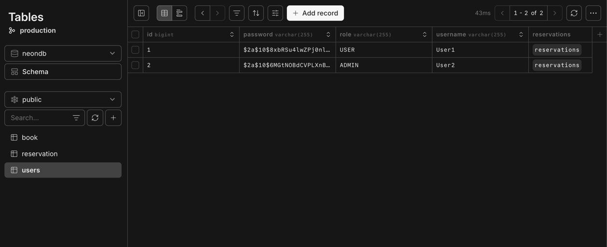
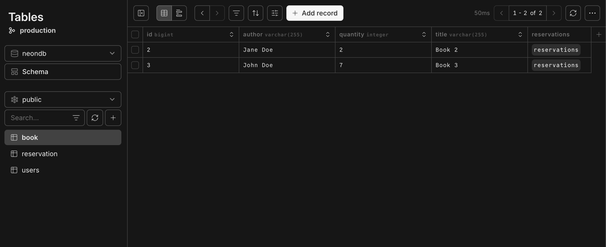
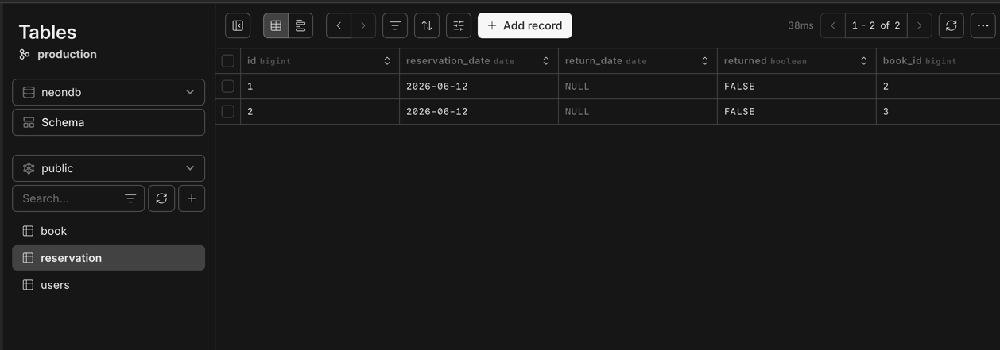
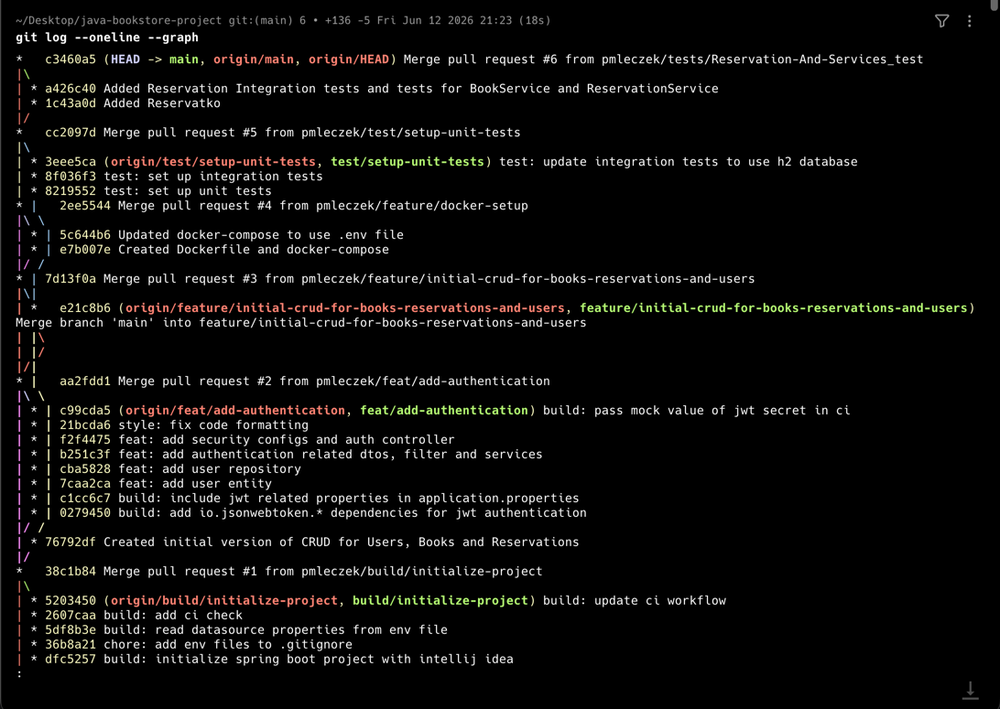
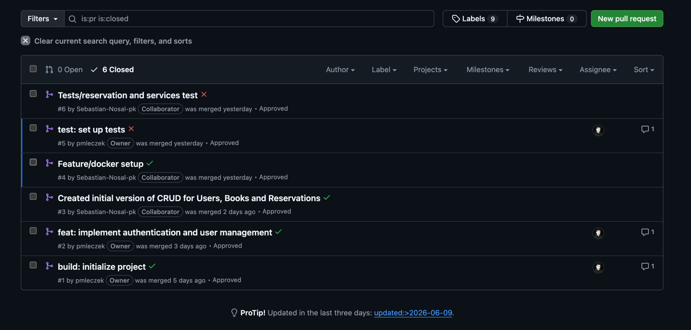

# java-bookstore-project

### Sebastian Nosal, Patryk Mleczek

## Uruchamianie

> W obu przypadkach wymagany jest plik `.env` ze zmiennymi środowiskowymi

### Z Dockerem

```shell
docker-compose up --build
```

### Bez Dockera

```shell
mvn clean install
mvn spring-boot:run
```

## API

### Uwierzytelnianie

#### /api/register (POST)

Umozliwia rejestrację uzytkownika typu `USER` (rejestracja uzytkownika `ADMIN` wymaga ręcznej modyfikacji w bazie danych).

Body:

```json
{
  "username": "nazwa_uzytkownika",
  "password": "haslo"
}
```

Response:

```json
{
  "token": "token_jwt"
}
```

#### /api/auth (POST)

Umozliwia zalogowanie się przez uzytkownika.

Body:

```json
{
  "login": "nazwa_uzytkownika",
  "password": "haslo"
}
```

Response:

```json
{
  "token": "token_jwt"
}
```

### Ksiązki

#### /api/books (POST)

Umozliwia dodanie nowej ksiązki (jedynie dla uzytkownikow z rolą `ADMIN`).

Body:

```json5
{
    "title": "tytul",
    "author": "autor",
    "quantity": 2 // dostępna liczba egzemplarzy
}
```

Response:

```text
Stworzony obiekt ksiązki
```

#### /api/books (GET)

Zwraca listę wszystkich dostępnych ksiązek.

Response:

```text
Lista dostępnych ksiązek
```

#### /api/books/{id} (GET)

Zwraca ksiązke o podanym identyfikatorze.

Response:

```text
Ksiązka o zadanym identyfikatorze
```

#### /api/books/{id} (DELETE)

Usuwa ksiązke o zadanym identyfikatorze (dostępne jedynie dla uzytkowników o roli `ADMIN`).

### Rezerwacje

#### /api/reservations/{id}

Rezerwuje ksiązke o podanym identyfikatorze (wymaga uwierzytelnienia).

Response:

```text
Informacje o stworzonej rezerwacji
```

## Zrzuty ekranu

### Tabele

#### Uzytkownicy (uwierzytelnianie)



#### Ksiazki



#### Rezerwacje



### Historia commitów



### Historia pull requestów


