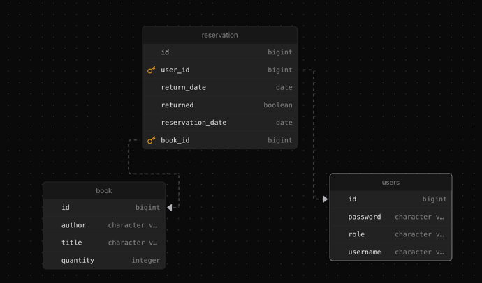
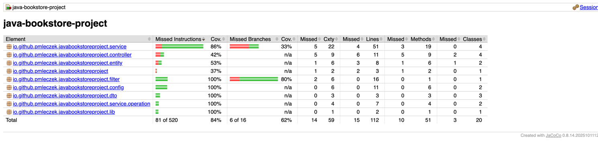
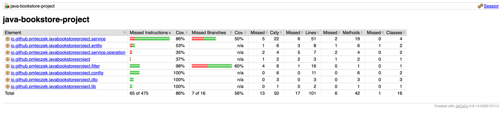

# java-bookstore-project

### Sebastian Nosal, Patryk Mleczek

## Uruchamianie

> W obu przypadkach wymagany jest plik `.env` ze zmiennymi środowiskowymi

### Z Dockerem

```shell
docker-compose up --build
```

### Bez Dockera

```shell
mvn clean install
mvn spring-boot:run
```

## Diagram ERD



## API

### Uwierzytelnianie

#### /api/register (POST)

Umożliwia rejestrację użytkownika typu `USER` (rejestracja użytkownika `ADMIN` wymaga ręcznej modyfikacji w bazie danych).

Body:

```json
{
  "username": "nazwa_uzytkownika",
  "password": "haslo"
}
```

Response:

```json
{
  "token": "token_jwt"
}
```

#### /api/auth (POST)

Umożliwia zalogowanie się przez użytkownika.

Body:

```json
{
  "login": "nazwa_uzytkownika",
  "password": "haslo"
}
```

Response:

```json
{
  "token": "token_jwt"
}
```

### Książki

#### /api/books (POST)

Umożliwia dodanie nowej książki (jedynie dla użytkownikow z rolą `ADMIN`).

Body:

```json5
{
    "title": "tytul",
    "author": "autor",
    "quantity": 2 // dostępna liczba egzemplarzy
}
```

Response:

```text
Stworzony obiekt książki
```

#### /api/books (GET)

Zwraca listę wszystkich dostępnych książek.

Response:

```text
Lista dostępnych książek
```

#### /api/books/{id} (GET)

Zwraca książke o podanym identyfikatorze.

Response:

```text
Książka o zadanym identyfikatorze
```

#### /api/books/{id} (DELETE)

Usuwa książke o zadanym identyfikatorze (dostępne jedynie dla użytkowników o roli `ADMIN`).

### Rezerwacje

#### /api/reservations/{id} (POST)

Rezerwuje książke o podanym identyfikatorze (wymaga uwierzytelnienia).

Response:

```text
Informacje o stworzonej rezerwacji
```

### Admin

#### /api/admin/reservations (GET)

Umożliwia dostęp do listy wszystkich rezerwacji (wymaga roli `ADMIN`).

#### /api/admin/user/{id} (GET)

Umożliwia dostęp do listy wszystkich rezerwacji użytkownika (wymaga roli `ADMIN`).

## Zrzuty ekranu

### Tabele

#### Użytkownicy (uwierzytelnianie)


#### Książki


#### Rezerwacje


### Historia commitów


### Historia pull requestów


## Pokrycie testami

### Testy jednostkowe



### Testy integracyjne


